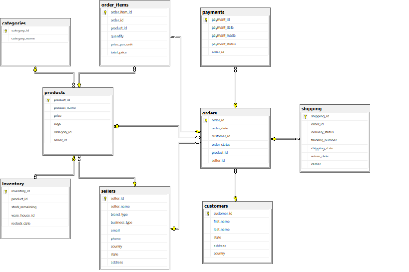

# 📦 EcommerceCART – Scalable E-Commerce Database using SQL SERVER

A high-performance, production-scale **relational database design for an e-commerce platform**, built on **Microsoft SQL Server**. This project demonstrates strong command of **data modeling**, **query optimization**, and **advanced SQL analytics** over a dataset containing **1+ million rows**.

This project covers From basic sql queries to Advanced sql queries
> 💼 Ideal for showcasing backend data engineering skills to employers and recruiters.

---

## 🧩 Project Overview

The **EcommerceCART** database simulates a full-fledged e-commerce ecosystem with entities like:
- Customers, Products, Orders
- Cart Management
- Shipping, Payments, and Reviews

It’s designed to **handle large volumes of data** efficiently and includes **business-critical queries** used in real-world applications such as:
- Revenue tracking
- Customer behavior analysis
- Product sales performance
- Inventory insights

---

## 📊 Database Architecture

The following ER diagram illustrates the core structure and table relationships:

---

## 🚀 Key Features

### ✅ Real-World Schema Design
- Fully normalized schema with proper use of **primary**, **foreign**, and **composite keys**
- Covers all essential modules of a modern e-commerce platform
- Built to scale and support future modular extensions

### ⚡ High-Performance SQL Queries
- Includes optimized queries for:
  - Best-selling products
  - Cart abandonment tracking
  - Monthly/Yearly revenue reports
  - Top-paying customers
- Designed to run efficiently even on datasets exceeding **1 million rows**

### 🛠️ Indexing & Optimization
- Indexes applied on frequently filtered or joined columns
- Performance-aware schema ideal for **query tuning** and **benchmarking**

### 📈 Advanced Data Insights
- Joins, subqueries, CTEs, aggregations, and window functions demonstrate proficiency in SQL
- Great foundation for **data analysis**, **BI dashboards**, or **reporting tools**

### 🔌 Integration Ready
- Easy to connect with application backends: Node.js, Django, Java Spring, etc.
- Can serve as a backend schema for a fully functional e-commerce web or mobile app

---
## Advanced SQL Features Implemented

- ✅ Inline and multi-statement Table-Valued Functions  
- ✅ Scalar Functions for category/product lookups  
- ✅ Recursive and analytical CTEs  
- ✅ Subqueries and window functions (RANK, LAG, etc.)  
- ✅ Views for inventory and category-level reporting  
---

## 📂 Project Files

| File                               | Description |
|------------------------------------|-------------|
| `database-schema.sql`              | Full database schema creation script with all tables, keys, and constraints |
| `Inventory.sql`                    | Read-only inventory analytics using CTEs, window functions, and CASE logic |
| `categories-sql-queries.sql`       | Queries focused on the categories table — includes views, functions, and CTEs |
| `order-items-sql-queries`          | Queries focused on order_items table  |
| `orders-sql-queries`                | Queries focused on orders table    |
| `Advanced-SQL-Queries.sql`         | Complex SQL logic using window functions, subqueries, and dynamic ranking |
| `EcommerceCART-Database-Diagram.png` | Visual ER diagram showing relationships between database tables |

---

## 📦 Dataset Access

> 📁 **Note**: The full dataset (1M+ rows) is not hosted in this repository due to size.

To request access to the data, contact:  
📧 [chandrasekharcse522@gmail.com](mailto:chandrasekharcse522@gmail.com)

Alternatively, you can load your own sample data using tools like [Mockaroo](https://mockaroo.com/) or generate random data via scripts.

---

## ✅ Setup Instructions

1. Install **SQL Server 2017 or later** and **SQL Server Management Studio (SSMS)**
2. Create a new database called `EcommerceCART`
3. Run `database-schema.sql` to generate tables
4. Import sample or full dataset
5. Import Inventory table related sql queries
6. Use `SQLQueryFile.sql` to explore the data

---

## 💡 Use Cases

This project is suitable for:

- 📌 **Portfolio showcasing** (database design, SQL skills, large data handling)
- 📌 **Data analyst / engineer interviews**
- 📌 Backend API development with relational storage
- 📌 Integration with e-commerce or inventory systems

---

## 🙌 Author

**Chandrasai Durgapu**  
[GitHub Profile](https://github.com/chandrasai-Durgapu)  
📧 [chandrasekharcse522@gmail.com](mailto:chandrasekharcse522@gmail.com)

---

## 📜 License

This project is licensed under the [MIT License](LICENSE).

---

## ⭐ Recruiter Highlights

- ✅ Designed for **scalability**, **performance**, and **real-world business logic**
- ✅ Hands-on experience with **millions of rows** in SQL Server
- ✅ Demonstrates strong **query writing**, **data modeling**, and **optimization** skills
- ✅ Ready for integration in full-stack or data engineering pipelines

> 💬 _“This project reflects my ability to build efficient and scalable database systems that support complex business operations.”_

---

---

